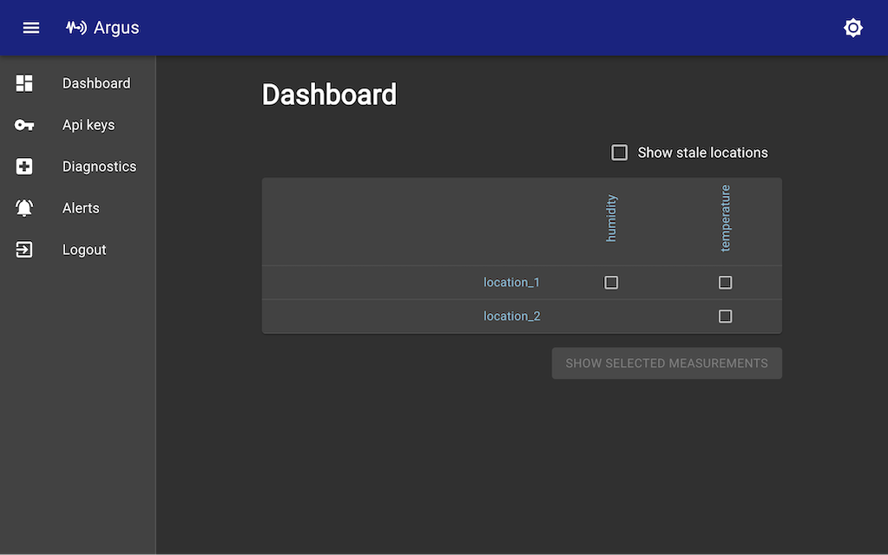
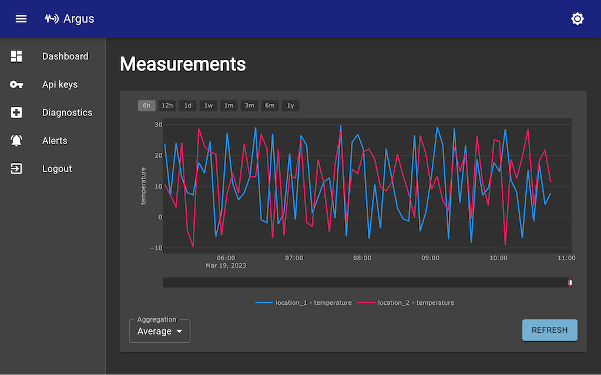

# Sensor data collection

Sensor data collection (codenamed SDC2) is a sensor monitoring solution built with MariaDB, NodeJS and React.
Developed and tested on a Raspberry Pi.

## Screenshots

## Modules

### Server application

- [Frontend](./packages/sdc2-frontend)
- [Backend](./packages/sdc2-server)

### Measurement clients

- [BME280](./packages/sdc2-client-bme280)
- [DHT22](./packages/sdc2-client-dht22)
- [HC-SR501](./packages/sdc2-client-hcsr501)
- [Mijia](./packages/sdc2-client-mijia)
- [Weather](./packages/sdc2-client-weather)

## Usage with docker-compose

Consult the documentation of the backend server and the modules you want to use, and create a `docker-compose.yml` file
containing the desired services.

Run the selected services with: `docker-compose up -d`.

## How to setup the development environment

1. This project requires NodeJS 14.x and Docker to be installed.
2. Initialize the Docker environment: `npm run bootstrap`
3. Start the dev servers: `npm run up`
4. Seed the database: `npm run seed`
5. View logs: `npm run logs`

That's it! Now you can visit http://localhost:8080 and login with `username` and `password`.

## How to add dependencies

The repository is a monorepo managed with [lerna](https://lerna.js.org/), so dependencies must be added with the
following command:

`npx lerna add <new-package> --scope=<package-to-install-to>`
